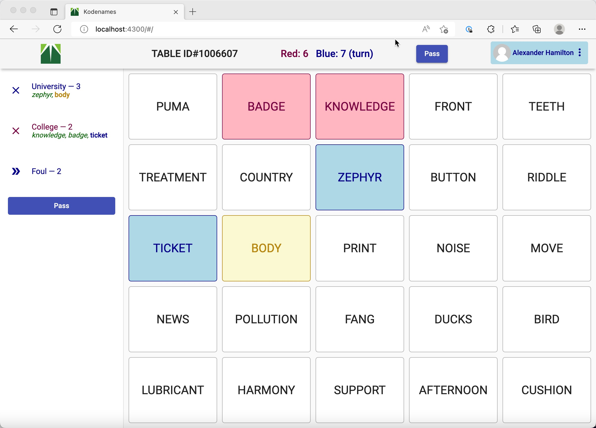

# Kodenames

Angular implementation of online Kodenames board game.  Inspired by the implementation by [ninjabunny](https://github.com/ninjabunny/KodeNames).

Try it out at [https://kodenames.morlok.com](https://kodenames.morlok.com) 🎉



# Local Development

Install dependencies:

```
npm install
```

Host the Angular app locally:

```
npm run webserver
```

```
open http://localhost:4300
```

# Deployment

Deployment happens automatically via Github Actions. Pull requests generate a preview URL 
and merging to master deploys the main app.
